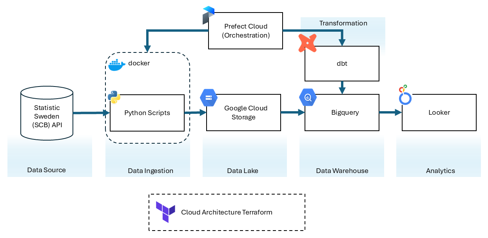
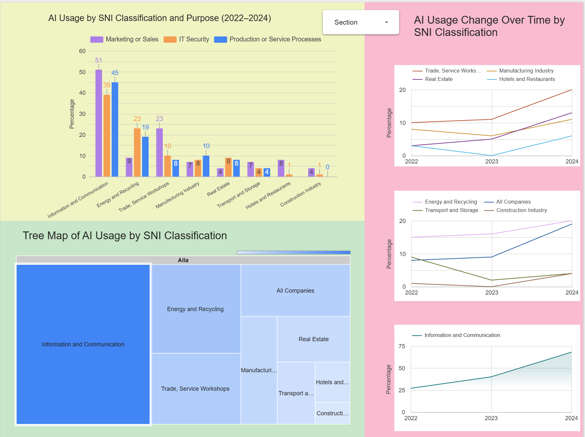

# zoomcamp-project
End-to-end data pipeline 

## Project Overview

## Problem Statement

## Overview of Solution

# Zoomcamp Project – AI Adoption in Swedish Companies

This project implements an end-to-end data pipeline to analyze how companies in Sweden adopt artificial intelligence technologies. 

The dataset is sourced from Statistics Sweden (SCB), focusing on the usage of AI-based software or systems across company size, region, and industry from 2021 to 2024.

This pipeline demonstrates a modern data engineering workflow:

- Data ingestion is performed by dynamically querying SCB’s RESTful API.
- The data is saved as a CSV file and uploaded to Google Cloud Storage.
- A Terraform script provisions the required GCP infrastructure (bucket + dataset).
- The ingested data is then transformed using dbt and analyzed in Looker Studio / Power BI.
- The project is containerized using Docker and can be orchestrated via Airflow or Prefect.

The goal is to create a reproducible pipeline using modern data engineering tools, with the final insights visualized in an interactive dashboard.

**Tech stack:**
- Docker & Python
- Google Cloud Storage (GCS)
- BigQuery (data warehouse)
- dbt (transformations)
- Looker Studio  or Power BI (dashboard)


## Step-by-step Guide

This guide is designed to help you set up and run the zoomcamp-project end-to-end data pipeline, even if you are new to the tools and technologies involved. Each step is explained in a way that ensures you can follow along without prior knowledge of data engineering.

### Prerequisites

Before starting, make sure you have a code editor installed. If you don’t already have a favorite, [Visual Studio Code (VS Code)](https://code.visualstudio.com/) is a commonly used option that I have chosen for this project. However, you can use any editor you’re comfortable with.

# Install Tools

- **Install a code editor** (VS Code, or any code editor of your choice).
  - [Download VS Code here](https://code.visualstudio.com/).
- **Install Docker** and **Docker Compose**.
  - [Install Docker here](https://www.docker.com/get-started).
- **Install Google Cloud SDK** (for GCP authentication).
  - [Install the Google Cloud SDK here](https://cloud.google.com/sdk/docs/install).
- **Install Terraform** (for provisioning infrastructure).
  - [Install Terraform here](https://www.terraform.io/downloads).
- **Install dbt** (for data transformations).
  - You can install dbt with `pip` (Python package manager). Since im using BigQuery i install the following:
    ```bash
    pip install dbt-bigquery
    ```
  - For detailed installation instructions, refer to the official [dbt installation guide](https://docs.getdbt.com/docs/installation).
  - **Install Prefect** (workflow orchestration tool)
  - Install with pip:
    ```bash
    pip install prefect
    ```


# Google Cloud Setup


1. **Create a Google Cloud Account**  
   Sign up at [Google Cloud](https://cloud.google.com/) to get started.

2. **Generate and Configure Service Account Credentials**  
   - Create a service account and generate a **JSON key** [here](https://console.cloud.google.com/iam-admin/serviceaccounts).
   - Set the credentials environment variable:

   ```bash
   export GOOGLE_APPLICATION_CREDENTIALS="/path/to/your/credentials-file.json"

# Terraform Setup

1. **Initialize Terraform**, **Plan** the Infrastructure Deployment, and **Apply** the Terraform Configuration to create the GCS bucket and BigQuery dataset in your Google Cloud account:

# Files in the `terraform/` folder:´
 - `main.tf`         Defines the GCS bucket and BigQuery dataset 
 - `variables.tf`    Declares input variables used by Terraform
 - `terraform.tfvars`  Contains actual values like project ID, region, etc.
 - `outputs.tf`        Displays output values after resources are created 

 Run command:
    ```bash
   terraform init
   terraform plan
   terraform apply

Required permissions: Make sure the service account (GCS) you're using has these IAM roles:
  - Storage Admin
  - BigQuery Admin
Assign roles via the IAM Console.

## Architecture
Now that we have set up all the necessary tools and accounts, let's move on to the architecture process. The diagram below illustrates the high-level architecture of the end-to-end data pipeline implemented in this project. Each component plays a specific role in the process of ingesting, transforming, and visualizing SCB-provided CSV data. 




1. Provision Infrastructure with Terraform  
Terraform is used to automatically create:
- A Google Cloud Storage (GCS) bucket for storing raw data
- A BigQuery dataset for analytics and transformation

Navigate to
Commands:
    ```bash
      terraform init
      terraform plan
      terraform apply


2. SCB (CSV Data)
 - Source: Data is fetched from the official [SCB Statistics Database](https://www.statistikdatabasen.scb.se/pxweb/sv/ssd/). The source data comes from the official Swedish statistics bureau (SCB).
 - Dataset: Dataset: The dataset contains information on AI adoption in Swedish companies (2021, 2023 & 2024), retrieved directly from SCB’s public PxWeb API.
 - API Ingestion: Instead of downloading a CSV file manually, the data is fetched automatically via a Python script using a structured JSON POST request to SCB’s official API [([PxWeb API 2.0](https://www.scb.se/vara-tjanster/oppna-data/pxwebapi/pxwebapi-2.0)).
 - Frequency: Although the underlying dataset is updated annually, the pipeline is scheduled to run monthly to simulate real-time ingestion and demonstrate workflow orchestration best practices.


 
3. Docker (Python ETL)
- Create Dockerfile: You can find the Dockerfile for the Python ETL process in the repository under the Dockerfile
- Create Docker Image: 
    ```bash
    docker build -t <pick a name for image> .
- Run Docker Container: 
     ```bash
    docker run -d --name <pick a name for containter> <name of image>
- Python Script: The Python script inside the Docker container performs the following steps:
 - Sends a POST request to the SCB API and retrieves the filtered dataset in JSON format.
 - Converts the response into a clean pandas DataFrame.
 - Saves the data as a CSV file (data.csv) in the container.
 - Uploads the CSV file to Google Cloud Storage (GCS) for downstream processing.

4. Google Cloude Storage (Data Lake)
- Purpose: Google Cloud Storage (GCS) is used as a data lake to store the raw CSV data files before they are loaded into the data warehouse (BigQuery).
- Data Upload: The Python ETL script inside the Docker container uploads the data.csv file into a GCS bucket for storage.

5. BigQuery (Data Warehouse)

The raw CSV file stored in Google Cloud Storage is batch-loaded into BigQuery using a Python script (load_to_bigquery.py).
BigQuery acts as the central data warehouse, enabling scalable querying and downstream transformations with dbt.

**Steps performed in this stage:**
- Connect to BigQuery using the `google-cloud-bigquery` Python client.
- Load the `data.csv` file directly from the GCS bucket (`zoomcamp-data-bucket`).
- Create the table `ai_adoption` inside the BigQuery dataset (`zoomcamp_ai`).
- Automatically detect schema and ingest the data.

6. dbt (Transformations)
# Overview:
Used dbt to transform raw data in BigQuery, applying necessary translations and preparing data for analysis.
# Steps:
- Models: Created models to translate the Section, Classification, and Region columns.
- Translation: Translated these columns using a join on the label table, while keeping the Company Size column unchanged.
- Execution: Ran dbt to execute the transformations, creating the ai_adoption_translation model.

7. [Dashboard](https://lookerstudio.google.com/reporting/4285d0bb-c7ef-44e3-abce-9220b4bcec80) (Looker Studio)
To visualize AI adoption data in Swedish companies, I created a Looker Studio dashboard connected to our BigQuery database. The dashboard provides insights into AI adoption across different sectors and years (2022–2024), giving users an interactive experience to explore trends and patterns.
# Steps Taken:
- Connecting BigQuery Database: I connected the BigQuery database, where the transformed data is stored, to Looker Studio. This enables seamless visualization of AI adoption data.
- Visualizations: I added several visualizations to give a comprehensive overview of the data:
  - Bar Chart: Displays AI adoption by SNI classification and purpose (e.g., Marketing or IT Security) for the years 2022–2024.
  - Line Chart: Shows the change in AI adoption over time (2022–2024) for each SNI classification.
  - Tree Map: A hierarchical visualization showing the distribution of AI adoption by SNI classification.
- Added a filter to switch between different sections.


8. Prefect: Workflow Orchestration
This project uses [Prefect](https://www.prefect.io/) to automate and orchestrate the data pipeline. Prefect handles the scheduling and execution of the ingestion and transformation tasks, ensuring that the AI adoption data is processed and updated regularly without manual intervention. Although the SCB dataset updates annually, we’ve configured the workflow to run monthly to demonstrate automation best practices and efficient orchestration design.

- We defined two main tasks in Prefect:
  - Building and Running the Docker Container: This task builds and runs the Docker container that fetches data from the SCB API, processes it, and uploads it to Google Cloud Storage (GCS).
  - Running DBT Transformations: After the Docker container task is completed, this task runs DBT transformations to process and clean the data, making it ready for analysis in BigQuery.
-Scheduling
  - We used Prefect's Interval Schedule to set up the flow to run every 30 days, simulating a real-time data ingestion pipeline, even though the source dataset only updates annually. This helps ensure that the data is always up to date for our analysis and visualizations.
- Flow Execution
  - The Prefect flow combines these tasks and is orchestrated to run automatically on a schedule, ensuring data is ingested, processed, and ready for reporting without manual intervention.
- Deployment 
  - The flow was deployed to Prefect Cloud, where it’s automatically triggered according to the defined schedule. This enables seamless data processing, transformation, and reporting without requiring any further input after initial setup.

### 9. Upload to GitHub

To make sure Prefect can access the project files, we uploaded the following to a GitHub repository:

- **DBT SQL files** for transformations
- **Python scripts** for ingestion and processing
- **Dockerfile** for building the Docker image
- **requirements.txt** listing all project dependencies

After uploading the files, we committed and pushed the changes to GitHub using the following commands:
     ```bash
        git add .
        git commit -m "Initial commit with project files"
        git push origin main
